# User Registration Flow - American Car Club Website

## What Happens When User Registers

```mermaid
graph TD
    User[👤 User] --> RegisterPage[📝 Registration Page]

    RegisterPage --> FillForm[✍️ Fill Form<br/>Username, Email, Password<br/>Car Info, Photos]

    FillForm --> ClickSubmit[🖱️ Click Submit Button]

    ClickSubmit --> Browser[🌐 Browser Sends Request]

    Browser --> Django[🐍 Django Backend<br/>accounts/views.py]

    Django --> ValidateForm[✅ Validate Form Data<br/>Check if email exists<br/>Password strength]

    ValidateForm --> SaveToDatabase[💾 Save to Database<br/>Create User Account<br/>Create Profile]

    SaveToDatabase --> CreateNotification[🔔 Create Admin Notification<br/>New user needs approval]

    CreateNotification --> SendResponse[📤 Send Response to Browser]

    SendResponse --> ShowSuccess[✅ Show Success Message<br/>Account created, waiting approval]

    ShowSuccess --> User

    %% Admin side
    CreateNotification --> AdminSees[👨‍💼 Admin Sees Notification<br/>In custom admin panel]

    AdminSees --> AdminApproves[✅ Admin Approves User]

    AdminApproves --> UserCanLogin[🎉 User Can Now Login<br/>And access full website]

    %% Simple black text styling
    classDef default fill:#e8f4fd,stroke:#1976d2,stroke-width:2px,color:#000000
    classDef userAction fill:#fff3e0,stroke:#f57c00,stroke-width:2px,color:#000000
    classDef system fill:#e8f5e8,stroke:#388e3c,stroke-width:2px,color:#000000
    classDef admin fill:#fce4ec,stroke:#c2185b,stroke-width:2px,color:#000000

    class User,FillForm,ClickSubmit userAction
    class Browser,Django,ValidateForm,SaveToDatabase,SendResponse system
    class CreateNotification,AdminSees,AdminApproves admin
```

## User Journey - American Car Club Website

This simple diagram shows what users see and how they navigate through the website:

### 🚀 **User Flow:**
1. **User** opens their web browser
2. **Browser** loads the main navigation
3. **Navigation** leads to the homepage
4. From **Homepage**, users can explore:
   - Club information (About)
   - Upcoming events (Events)
   - Online shop (Shop)
   - Social media links
   - User login/registration
   - Community forum

### 📱 **Page Categories:**
- 🔵 **Main Pages** (Blue): Core website content
- 🟢 **Shop Pages** (Green): E-commerce functionality
- 🟠 **User Pages** (Orange): Account management
- 🟣 **Forum Pages** (Purple): Community discussions

### 🎯 **Simple Navigation:**
- Users start at the top and flow downward
- Each page connects logically to related content
- Back navigation allows users to return to previous sections
- Footer provides additional access points from any page

## Data Flow

## Responsive Design Strategy

The website uses a mobile-first approach with these breakpoints:
- **Mobile**: < 768px (single column layouts)
- **Tablet**: 768px - 1024px (two column layouts)
- **Desktop**: > 1024px (multi-column layouts)

Key responsive features:
- Collapsible navigation menu
- Flexible grid systems
- Scalable images and media
- Touch-friendly interactive elements
- Optimized typography scaling
